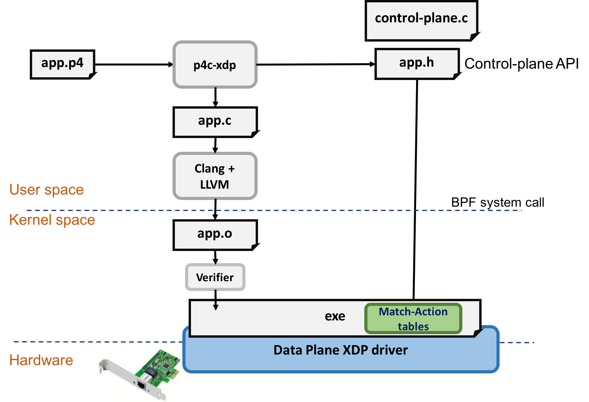

これは武蔵野アドベントカレンダー2018の14日目の記事っぽい。

私は武蔵野とか横須賀とかが関係する事情でOpenFlow1.3で必要十分、DPDK万歳派閥に属している。だが、バズってるものを触ったことないっていうのもあれなので、今回はP4とXDPを触ってみることにする。
ググるとp4c-xdpという一石二鳥なレポジトリがあるので今回はこれを触ってみた内容を紹介する。

https://github.com/vmware/p4c-xdp

p4cの公式にもp4c-ebpfとかいうディレクトリがあり、そっちのほうが更新が進んでいるようだがどうやらtc向けのebpfを吐くようだ。勉強不足であまり理解はしていない。

## 今回の目標

個人的にTurtrial 動かしましたブログを量産してもあれなので、すこし応用が効きそうなことをする。
具体的には、Vxlanの中身の送信元IPによってパケットフィルタを行う。

下のVM2のens7にXDPをアタッチし、VM2に入るVM1のns0からのパケットのみフィルタする。

```
                                  vm1
                                  +------------------------------------------------+
                                  |                                                |
                                  |    +--------------+      +--------------+      |
                                  |    |              |      |              |      |
                                  |    | ns0          |      | ns1          |      |
                                  |    | 192.168.0.10 |      | 192.168.0.11 |      |
                                  |    |              |      |              |      |
                                  |    +------+-------+      +------+-------+      |
                                  |           |                     |              |
                                  |           +-------+     +-------+              |
                                  |                   |     |                      |
                                  |                +--+-----+-+                    |
vm2                               |                |          |                    |
+------------------------+        |                |  virbr1  |                    |
|                        |        |                |          |                    |
|    +-------------+     |        |                +----+-----+                    |
|    |             |     |        |                     |                          |
|    | vxlan0      |     |        |                +----+-----+                    |
|    | 192.168.0.1 |     |        |                |          |                    |
|    |             |     |        |                |  vxlan0  |                    |
|    +-------+-----+     |        |                |          |                    |
|            |           |        |                +----+-----+                    |
|            |           |        |                     |                          |
|  +---------+--------+  |        |                  +--+---+                      |
|  |                  |  |        |                  |      |                      |
|  | ens7 with p4-xdp |  |        |                  | ens7 |                      |
|  |                  |  |        |                  |      |                      |
+--+---------+--------+--+        +------------------+--+---+----------------------+
             |                                          |
             |                                          |
             |                                          |
             |                                          |
             +------------------------------------------+


```


## いろいろ説明

### XDP

XDPはLinux kernel内で動作する、eBPFを用いたパケット処理基盤である。LinuxのNetworkStackの処理に入る前に処理を入れることができて強い。
詳しくは以下のスライドが参考になる。

https://speakerdeck.com/yunazuno/brief-summary-of-xdp-and-use-case-at-line


### P4

一般に、P4とはペルソナ４の略であるが、ネットワーク業界におけるP4とはどういうヘッダのパケットをどう転送するかみたいなことが自由に記述できる言語である。
日本語の良さげな資料がなかったので、[公式ページ](https://p4.org/)とか見てほしい。
どのくらい自由かというと、p4対応のスイッチで[なんか計算組み込めちゃうくらい自由](https://www.slideshare.net/kentaroebisawa/p4alu-arithmetic-logic-unit-in-p4)である。

\# ちょうどCiscoさんが2日前にP4について投稿してくれていたようです。
\# https://qiita.com/tkamata/items/4f26e83fdb7f00982009

### p4c-xdp

p4c-xdpはp4のコードをXDPのコードに書き換えてくれるコンパイラ(?)である。レポジトリにあるように下の絵の感じに動く。
ぶっちゃけ雑な理解しかしてないので、詳しくは、p4c-xdpのレポジトリにある[IOVisor summit 2017での発表資料](https://github.com/vmware/p4c-xdp/blob/master/doc/p4xdp-iovisor17.pdf)を参考にしてほしい。




kernelのhelper関数のないオレオレヘッダとかをXDPで処理したいとき、eBPFでパーサを書いたりマッチアクションを書いたりするのは非常にだるいがp4なら比較的簡単に書けるので便利である。
ただ、P4でXDPを動かすという前提から、p4c-xdpが動く範囲はp4で記述できる範囲でなおかつXDPで動作可能な範囲に限られる。
[p4c-ebpf](https://github.com/p4lang/p4c/tree/master/backends/ebpf)にある下の図がわかりやすい。これとだいたい同じ。


## 準備

私はUbuntu18.04で作業してる。
みんな大好きMacでVirtualBoxで動くか試してないが、[XDP-genericというものがあるらしい](http://yunazuno.hatenablog.com/entry/2017/06/12/094101)ので、動作テストはできると思う。
そういう人は適当に読み替えてほしい。

環境構築の履歴とか興味ねーよ、さっさとP4でXDPしたいんだって人は、[ここ](https://qiita.com/hibitomo/private/3ed846beb2e504f0ffb6#p4c-xdp%E3%81%AE%E3%82%A4%E3%83%B3%E3%82%B9%E3%83%88%E3%83%BC%E3%83%AB)まで飛ばしてください。

### 環境準備

とりあえず、VMをつくる。

```
$ sudo uvt-kvm create vm1 release=bionic --cpu 2 --memory 4096
$ sudo uvt-kvm create vm2 release=bionic --cpu 2 --memory 4096
```

とりあえず、Bridgeをつくる

```
$ cat ./libvirt_templates/networks/internal.xml
<network>
  <name>internal1</name>
  <bridge name="virbr1" />
</network>
$ sudo virsh net-define internal.xml
$ sudo virsh net-autostart internal1
```

interfaceをVMに刺す。[virtioを利用する場合、オフロード機能をOFFにする必要がある](http://yunazuno.hatenablog.com/?page=1494292914)。

```
$ cat ./libvirt_template/interfaces/if0.xml
<interface type='network'>
  <source network='internal1'/>
  <model type='virtio'/>
    <host gso='off' tso4='off' tso6='off' ecn='off' ufo='off'/>
    <guest tso4='off' tso6='off' ecn='off' ufo='off'/>
  </driver>
</interface>
$sudo virsh attach-device vm1 if0.xml --persistent
Device attached successfully

$sudo virsh attach-device vm2 if0.xml --persistent
Device attached successfully

```

アドレス割当

```
$ uvt-kvm ssh vm1
$ sudo ip addr add 10.0.0.1/24 dev ens7
$ sudo ip link set up dev ens7
$ exit
$ uvt-kvm ssh vm2
$ sudo ip addr add 10.0.0.2/24 dev ens7
$ sudo ip link set up dev ens7
$ exit
```

VxLANインターフェースの作成とアドレス割当

```
$ uvt-kvm ssh vm1
$ sudo ip link add vxlan0 type vxlan id 10 remote 10.0.0.1 dstport 4789 dev ens7
$ sudo ip link set up vxlan0
$ sudo ip addr add 192.168.0.1/24 dev vxlan0
$ exit
$ uvt-kvm ssh vm2
$ sudo ip link add vxlan0 type vxlan id 10 remote 10.0.0.2 dstport 4789 dev ens7
$ sudo ip link set up vxlan0
$ sudo ip addr add 192.168.0.2/24 dev vxlan0
$ ping -I vxlan0 192.168.0.1
$ exit
```

VM1の方にはBridgeとNetwork Namespaceを追加する

```
$ uvt-kvm ssh vm1
$ sudo apt install bridge-utils
$ sudo brctl addbr br0
$ sudo brctl stp br0 off
$ sudo brctl addif br0 vxlan0
$ sudo ip netns add ns0
$ sudo ip netns add ns1
$ sudo ip link add veth0 type veth peer name ns0-veth0
$ sudo ip link add veth1 type veth peer name ns1-veth0
$ sudo ip link set ns0-veth0 netns ns0
$ sudo ip link set ns1-veth0 netns ns1
$ sudo brctl addif br0 veth0
$ sudo brctl addif br0 veth1
$ sudo ip link set up veth0
$ sudo ip link set up veth1
$ sudo ip netns exec ns0 ip link set up lo
$ sudo ip netns exec ns0 ip link set up ns0-veth0
$ sudo ip netns exec ns0 ip addr add 192.168.0.10/24 dev ns0-veth0
$ sudo ip netns exec ns1 ip link set up lo
$ sudo ip netns exec ns1 ip link set up ns1-veth0
$ sudo ip netns exec ns1 ip addr add 192.168.0.20/24 dev ns1-veth0
$ exit
```

### p4c-xdpのインストール

とりあえず、p4cのREADMEに従ってパッケージを入れる。

```
$ uvt-kvm ssh vm2
$ sudo apt update && sudo apt upgrade -y
$ sudo apt install cmake g++ git automake libtool libgc-dev bison flex libfl-dev libgmp-dev libboost-dev libboost-iostreams-dev libboost-graph-dev llvm pkg-config python python-scapy python-ipaddr python-ply tcpdump python-pip unzip
$ sudo pip install tenjin pyroute2 ply scapy
```

XDP周りで必要になるパッケージも入れる

```
$ sudo apt install clang llvm libpcap-dev libelf-dev iproute2 net-tools
```

あとはProtocolbufferをいれる。v3.2.0がおすすめらしいが、aptだとv3.0.0だったりするので最新をいれておく。

```
$ wget http://github.com/protocolbuffers/protobuf/releases/download/v3.6.1/protobuf-cpp-3.6.1.zip
$ unzip protobuf-cpp-3.6.1.zip
$ cd protobuf-3.6.1
$ ./configure
$ make
$ make check
$ sudo make install
$ sudo ldconfig
```

p4c, p4c-xdpのインストール。p4c-xdpはp4cのextensionとしてはいる。
p4c-xdpはmaster。p4cのCommitはv1.0.0-rc4っぽいやつにした。

```
$ git clone https://github.com/p4lang/p4c
$ cd p4c
$ git checkout 027098cc5720f7a03f5b7e745d15e5d840c8daa0
$ git submodule update --init --recursive
$ mkdir -p extensions
$ cd extensions
$ git clone https://github.com/vmware/p4c-xdp
$ ln -s ~/p4c p4c-xdp/p4c
$ cd ..
$ mkdir -p build
$ cd build
$ cmake .. '-DCMAKE_CXX_FLAGS:STRING=-O2'
$ make
$ cd ~/p4c/extensions/p4c-xdp
$ ln -s ~/p4c/build/p4c-xdp p4c-xdp
$ cd ~/p4c/extensions/p4c-xdp
$ ln -s ~/p4c/extensions/p4c-xdp/xdp_target.py ~/p4c/backends/ebpf/targets/xdp_target.py
$ ln -s ~/p4c/backends/ebpf/run-ebpf-test.py run-ebpf-test.py
$ cd ~/p4c/build
$ make check-xdp
$ sudo make install
```

## p4 to xdp

### p4

p4のコードは、p4c-xdp/tests/以下にあるp4のコードを参考にする。
今回は[xdp1.p4](https://github.com/vmware/p4c-xdp/blob/master/tests/xdp1.p4)を参考にした。ether_typeが0x0800でなければ落とすという簡単なサンプルである。
これにVxLANとInnerのパーサを追加して、ether_typeのチェック部分をVxLAN内部のsrcAddrが192.160.0.10(0xC0A8000A))だったら落とすという処理に変更した。
コードは以下の通り。

```

#include "xdp_model.p4"

header Ethernet {
    bit<48> destination;
    bit<48> source;
    bit<16> protocol;
}

header IPv4 {
    bit<4>  version;
    bit<4>  ihl;
    bit<8>  diffserv;
    bit<16> totalLen;
    bit<16> identification;
    bit<3>  flags;
    bit<13> fragOffset;
    bit<8>  ttl;
    bit<8>  protocol;
    bit<16> hdrChecksum;
    bit<32> srcAddr;
    bit<32> dstAddr;
}

header UDP {
    bit<16> srcPort;
    bit<16> dstPort;
    bit<16> length;
    bit<16> chksum;
}

header VxLAN {
    bit<8> VXLAN;
    bit<24> Reserved;
    bit<24> VNID;
    bit<8> Reserved2;
}

struct Headers {
    Ethernet ethernet;
    IPv4     ipv4;
    UDP udp;
    VxLAN vxlan;
    Ethernet inner_ethernet;
    IPv4     inner_ipv4;
}

parser Parser(packet_in packet, out Headers hd) {
    state start {
        packet.extract(hd.ethernet);
        transition select(hd.ethernet.protocol) {
            16w0x800: parse_ipv4;
            default: accept;
        }
    }

    state parse_ipv4 {
        packet.extract(hd.ipv4);
        transition select(hd.ipv4.protocol) {
            8w0x11: parse_udp;
            default: accept;
        }
    }

    state parse_udp {
        packet.extract(hd.udp);
        transition select(hd.udp.dstPort) {
            16w0x12b5: parse_vxlan;
            default: accept;
        }
    }

    state parse_vxlan {
        packet.extract(hd.vxlan);
        transition parse_inner_ethernet;
    }

    state parse_inner_ethernet {
        packet.extract(hd.inner_ethernet);
        transition select(hd.inner_ethernet.protocol) {
            16w0x800: parse_inner_ipv4;
            default: accept;
        }
    }

    state parse_inner_ipv4 {
        packet.extract(hd.inner_ipv4);
        transition accept;
    }
}

control Ingress(inout Headers hdr, in xdp_input xin, out xdp_output xout) {
    apply {
        xout.output_port = 0;
        xout.output_action = (hdr.inner_ipv4.srcAddr == 0xC0A8000A) ? xdp_action.XDP_DROP : xdp_action.XDP_PASS;
    }
}

control Deparser(in Headers hdrs, packet_out packet) {
    apply {
        packet.emit(hdrs.ethernet);
        packet.emit(hdrs.ipv4);
        packet.emit(hdrs.udp);
        packet.emit(hdrs.vxlan);
        packet.emit(hdrs.inner_ethernet);
        packet.emit(hdrs.inner_ipv4);
    }
}

xdp(Parser(), Ingress(), Deparser()) main;

```

### p4c -> XDP

p4c-xdpでこのp4ファイルからXDPのプログラムを履いてもらう

```
p4c-xdp --target xdp -o xdp_vxlan.c xdp_vxlan.p4
```

これでxdp_vxlan.cとxdp_vxlan.hが生成される。
これをclangでコンパイルして、ip コマンドでアタッチすればハッピー　。。。。とはまだならない。

### 生成されたコードの修正

生成されたコードはエラーが出てコンパイルできない。なぜならVxLANの中までパースして大きくなりすぎたから。
生成されたコードを読んでみると明らかにDeparser部分が重いことがわかる。
今回はヘッダの書き換えを行わないので、Deparser部分( `/* deparser */` から `ebpf_end:` まで)はまるまる削除する。

```
$ sed -i -e '/\/\* deparser \*\//,/ebpf_end:/cebpf_end:' xdp_vxlan.c
```

ここまででXDPとして動くようになるが、まだ正しく動かない。
内部のsrcIPでフィルタする処理の部分を見るとこんな感じになってる。

```c

   accept:
    {
     	u8 hit;
	enum xdp_action tmp;
	{
xout.output_port = 0;
            if ((hd.inner_ipv4.srcAddr == 3232235530))
		tmp = XDP_DROP;
            else
                tmp = XDP_PASS;
            xout.output_action = tmp;
	}
    }
```

3232235530は192.168.0.10なので正しく動きそうに見えるが、これだとARPなど、VxLAN上にIPがあるパケットではなかった場合の考慮が足りない(その場合、if文でhd.inner_ipv4.srcAddrが未定義のまま比較されてしまう)ので以下のように修正する。

```c
     accept:
      {
       	u8 hit;  
  	enum xdp_action tmp;
  	{
xout.output_port = 0;
+             if ((hd.inner_ipv4.ebpf_valid && hd.inner_ipv4.srcAddr == 3232235530))
-             if ((hd.inner_ipv4.srcAddr == 3232235530))
  		tmp = XDP_DROP;
              else
                tmp = XDP_PASS;
            xout.output_action = tmp;
	}
    }
```

### コンパイルとXDPのアタッチ

コンパイルの際はヘッダファイルが足りないと怒られるので、適当に探して追加しておく。

```
 clang -Wno-unused-value -Wno-pointer-sign -Wno-compare-distinct-pointer-types -Wno-gnu-variable-sized-type-not-at-end -Wno-tautological-compare -I ~/p4c/extensions/p4c-xdp/tests/ -I ~/p4c/backends/ebpf/runtime/ -O2 -emit-llvm -g -c xdp_vxlan.c -o -| llc -march=bpf -filetype=obj -o xdp_vxlan.o
```

Interfaceにアタッチ

```
$ sudo ip link set dev ens7 xdp obj test.o verb
```

これで、Vxlanの中のsrcIPが192.168.0.10の場合、パケットが通らないはずである。ARPは通る。
デタッチはこれ。

```
$ sudo ip link set dev ens7 xdp off
```

## まとめ

P4の簡単さとXDPの強さを一緒に使えるp4c-xdpには夢がある。ただebpfっていう限られた環境でp4使い倒すのは難しかった。パケットパーサ部分を生成してくれるだけでもうれしいので、使い道はありそう。

XDPはトンネルの中を覗き込むという変なこともできて強い。さらにXDPのあとにLinuxのNetwork Stackがなんとかしてくれるという安心感はとても大きい。今回、P4でVxLANの中身でフィルタリングのコードを書いたが、それ以外のルーティングもVxLANのencap/decapもICMPもMACラーニングも書いてない。XDP_PASSですべてカーネルが処理してくれている。DPDKが捨てたカーネル様のご加護がすごい。

P4はオレオレヘッダでもなんでも簡単にパーサ、マッチアクション、デパーサ書けて強い。結構簡単にかけるのでオレオレプロトコルのプロトタイプも簡単そう。論文で「P4でも実装してみたぜ」っていう記述をよく見かけるのも納得である。

\# p4をDPDKにする子もいるらしい https://github.com/P4ELTE/t4p4s
