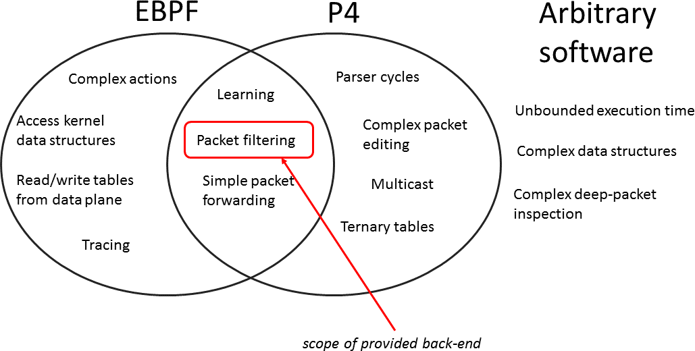

# Advent Calendar

## XDPをP4でいじる（VxLANのinnerでフィルタリング）

- とある事情でOpenFlow1.3で必要十分、DPDK万歳派閥に属していたため、XDPとP4は知識でしか知らなかった。
- AdventCalendarを書く機会を頂いたので、どうせなら触ってないものを触ってみる。
- ググるとp4c-xdpというVMwareの素敵そうなレポジトリがあるので触ってみる。
- p4cの公式にp4c-ebpfとかいうディレクトリがあり、そっちのほうが更新が進んでいるがどうやらtc向けのebpfを吐くようだ。

## 前提

- 文才がないのでXDPとP4については知っているものとして説明は省略する。流行りものなのでぐぐったらいろんな資料がでてくると思う
- 何ができるかという点については、P4でXDPを動かすという前提から、p4c-xdpが動く範囲はp4で記述できる範囲でなおかつXDPで動作可能な範囲に限られる。p4c-ebpfにある下の図がわかりやすい。これとだいたい同じ。




## 今回の目標

- Turtrial 動かしましたブログを量産するのは趣味ではないので、すこし応用が聞きそうなことをする。
- 具体的には、Vxlanのインナーのパケットのアドレスによってパケットフィルタを行う。
- トンネルされてるパケットのデバッグが辛いという課題を解決する可能性を示すものである。


## 準備

### テスト環境

- Ubuntu18.04

```
                                  vm1
                                  +------------------------------------------------+
                                  |                                                |
                                  |    +--------------+      +--------------+      |
                                  |    |              |      |              |      |
                                  |    | ns0          |      | ns1          |      |
                                  |    | 192.168.0.10 |      | 192.168.0.11 |      |
                                  |    |              |      |              |      |
                                  |    +------+-------+      +------+-------+      |
                                  |           |                     |              |
                                  |           +-------+     +-------+              |
                                  |                   |     |                      |
                                  |                +--+-----+-+                    |
vm2                               |                |          |                    |
+------------------------+        |                |  virbr1  |                    |
|                        |        |                |          |                    |
|    +-------------+     |        |                +----+-----+                    |
|    |             |     |        |                     |                          |
|    | vxlan0      |     |        |                +----+-----+                    |
|    | 192.168.0.1 |     |        |                |          |                    |
|    |             |     |        |                |  vxlan0  |                    |
|    +-------+-----+     |        |                |          |                    |
|            |           |        |                +----+-----+                    |
|            |           |        |                     |                          |
|  +---------+--------+  |        |                  +--+---+                      |
|  |                  |  |        |                  |      |                      |
|  | ens7 with p4-xdp |  |        |                  | ens7 |                      |
|  |                  |  |        |                  |      |                      |
+--+---------+--------+--+        +------------------+--+---+----------------------+
             |                                          |
             |                                          |
             |                                          |
             |                                          |
             +------------------------------------------+


```

とりあえず、VMをつくる

```
$ sudo uvt-kvm create vm1 release=bionic --cpu 2 --memory 4096
$ sudo uvt-kvm create vm2 release=bionic --cpu 2 --memory 4096
```

とりあえず、Bridgeをつくる

```
$ cat internal_br.xml
<network>
  <name>internal1</name>
  <bridge name="virbr1" />
</network>
$ sudo virsh net-define internal_br.xml
$ sudo virsh net-autostart internal1.xml
```

interfaceをVMに刺す

```
$ cat if0.xml
<interface type='network'>
  <source network='internal1'/>
  <model type='virtio'/>
    <host gso='off' tso4='off' tso6='off' ecn='off' ufo='off'/>
    <guest tso4='off' tso6='off' ecn='off' ufo='off'/>
  </driver>
</interface>
$sudo virsh attach-device vm1 if0.xml --persistent
Device attached successfully

$sudo virsh attach-device vm2 if0.xml --persistent
Device attached successfully

```

接続テスト

```
$ uvt-kvm ssh vm1
$ sudo ip addr add 10.0.0.1/24 dev ens7
$ sudo ip link set up dev ens7
$ exit
$ uvt-kvm ssh vm2
$ sudo ip addr add 10.0.0.2/24 dev ens7
$ sudo ip link set up dev ens7
$ ping 10.0.0.1
PING 10.0.0.1 (10.0.0.1) 56(84) bytes of data.
64 bytes from 10.0.0.1: icmp_seq=1 ttl=64 time=0.754 ms
64 bytes from 10.0.0.1: icmp_seq=2 ttl=64 time=0.414 ms
^C
--- 10.0.0.1 ping statistics ---
2 packets transmitted, 2 received, 0% packet loss, time 1000ms
rtt min/avg/max/mdev = 0.414/0.584/0.754/0.170 ms
$ exit
```

VxLAN interface

```
$ uvt-kvm ssh vm1
$ sudo ip link add vxlan0 type vxlan id 10 remote 10.0.0.1 dstport 4789 dev ens7
$ sudo ip link set up vxlan0
$ sudo ip addr add 192.168.0.1/24 dev vxlan0
$ exit
$ uvt-kvm ssh vm2
$ sudo ip link add vxlan0 type vxlan id 10 remote 10.0.0.2 dstport 4789 dev ens7
$ sudo ip link set up vxlan0
$ sudo ip addr add 192.168.0.2/24 dev vxlan0
$ ping -I vxlan0 192.168.0.1
```

VM1の方にはBridgeとNamespaceを追加する

```
$ sudo apt install bridge-utils
$ sudo brctl addbr br0
$ sudo brctl stp br0 off
$ sudo brctl addif br0 vxlan0
$ sudo ip netns add ns0
$ sudo ip netns add ns1
$ sudo ip link add veth0 type veth peer name ns0-veth0
$ sudo ip link add veth1 type veth peer name ns1-veth0
$ sudo ip link set ns0-veth0 netns ns0
$ sudo ip link set ns1-veth0 netns ns1
$ sudo brctl addif br0 veth0
$ sudo brctl addif br0 veth1
$ sudo ip link set up veth0
$ sudo ip link set up veth1
$ sudo ip netns exec ns0 ip link set up lo
$ sudo ip netns exec ns0 ip link set up ns0-veth0
$ sudo ip netns exec ns0 ip addr add 192.168.0.10/24 dev ns0-veth0
$ sudo ip netns exec ns1 ip link set up lo
$ sudo ip netns exec ns1 ip link set up ns1-veth0
$ sudo ip netns exec ns1 ip addr add 192.168.0.20/24 dev ns1-veth0
$ sudo ip netns exec ns1 ping 192.168.0.2
```

## p4c-xdp setup

やっとほんちゃんの準備.とりあえず、READMEに従ってパッケージを入れる。
DockerFileに書いてあったパッケージも入れてみた入りしたので、下のやつだけじゃ足りないかもしれないし、足りるかもしれない。

```
$ sudo apt update && sudo apt upgrade -y
$ sudo apt-get install cmake g++ git automake libtool libgc-dev bison flex libfl-dev libgmp-dev libboost-dev libboost-iostreams-dev libboost-graph-dev llvm pkg-config python python-scapy python-ipaddr python-ply tcpdump
$ sudo pip install tenjin pyroute2 ply scapy
```

下の手順でmakeするがStratumあたりのコードが入ってきているであろう、protobufがないと怒られる

```
$ wget http://github.com/protocolbuffers/protobuf/releases/download/v3.6.1/protobuf-cpp-3.6.1.zip
$ unzip protobuf-cpp-3.6.1.zip
$ cd protobuf-3.6.1
$ ./configure
$ make
$ make check
$ sudo make install
$ sudo ldconfig
```

いろいろ試したがコンパイルできたりできなかったりする。多分MakeFileがどこかおかしいのではないだろうか。
保証はしないが多分下の手順でうごく

```
$ git clone https://github.com/p4lang/p4c
$ cd p4c
$ git checkout 027098cc5720f7a03f5b7e745d15e5d840c8daa0
$ git submodule update --init --recursive
$ mkdir -p extensions
$ cd extensions
$ git clone https://github.com/vmware/p4c-xdp
$ ln -s ~/p4c p4c-xdp/p4c
$ cd ..
$ mkdir -p build
$ cd build
$ cmake .. '-DCMAKE_CXX_FLAGS:STRING=-O2'
$ make
$ cd ~/p4c/extensions/p4c-xdp
$ ln -s ~/p4c/build/p4c-xdp p4c-xdp
$ cd ~/p4c/extensions/p4c-xdp
$ ln -s ~/p4c/extensions/p4c-xdp/xdp_target.py ~/p4c/backends/ebpf/targets/xdp_target.py
$ ln -s ~/p4c/backends/ebpf/run-ebpf-test.py run-ebpf-test.py
$ cd ~/p4c/build
$ make check-xdp
$ sudo make install
```

## p4

- p4のコードはXDPとの連携部分とかよくわからないので、p4c-xdp/tests/以下にあるp4のコードを参考にする。
- とりあえず今回は `xdp1.p4`
- これにVxLANとInnerのパーサを追加して、もともとether_typeが0x0800でなければ落とすというものだったものを、innerのsrcAddrが192.160.0.10(0xC0A8000A))だったら落とすという処理に変更した。

```
#include "xdp_model.p4"

header Ethernet {
    bit<48> destination;
    bit<48> source;
    bit<16> protocol;
}

header IPv4 {
    bit<4>  version;
    bit<4>  ihl;
    bit<8>  diffserv;
    bit<16> totalLen;
    bit<16> identification;
    bit<3>  flags;
    bit<13> fragOffset;
    bit<8>  ttl;
    bit<8>  protocol;
    bit<16> hdrChecksum;
    bit<32> srcAddr;
    bit<32> dstAddr;
}

header UDP {
    bit<16> srcPort;
    bit<16> dstPort;
    bit<16> length;
    bit<16> chksum;
}

header VxLAN {
    bit<8> VXLAN;
    bit<24> Reserved;
    bit<24> VNID;
    bit<8> Reserved2;
}

struct Headers {
    Ethernet ethernet;
    IPv4     ipv4;
    UDP udp;
    VxLAN vxlan;
    Ethernet in_ethernet;
    IPv4     in_ipv4;
}

parser Parser(packet_in packet, out Headers hd) {
    state start {
        packet.extract(hd.ethernet);
        transition select(hd.ethernet.protocol) {
            16w0x800: parse_ipv4;
            default: accept;
        }
    }

    state parse_ipv4 {
        packet.extract(hd.ipv4);
        transition select(hd.ipv4.protocol) {
            8w0x11: parse_udp;
            default: accept;
        }
    }

    state parse_udp {
        packet.extract(hd.udp);
        transition select(hd.udp.dstPort) {
            16w0x12b5: parse_vxlan;
            default: accept;
        }
    }

    state parse_vxlan {
        packet.extract(hd.vxlan);
        transition parse_in_ethernet;
    }

    state parse_in_ethernet {
        packet.extract(hd.in_ethernet);
        transition select(hd.in_ethernet.protocol) {
            16w0x800: parse_in_ipv4;
            default: accept;
        }
    }

    state parse_in_ipv4 {
        packet.extract(hd.in_ipv4);
        transition accept;
    }
}

control Ingress(inout Headers hdr, in xdp_input xin, out xdp_output xout) {
    apply {
        xout.output_port = 0;
        xout.output_action = (hdr.in_ipv4.srcAddr == 0xC0A8000A) ? xdp_action.XDP_DROP : xdp_action.XDP_PASS;
    }
}

control Deparser(in Headers hdrs, packet_out packet) {
    apply {
        packet.emit(hdrs.ethernet);
        packet.emit(hdrs.ipv4);
        packet.emit(hdrs.udp);
        packet.emit(hdrs.vxlan);
        packet.emit(hdrs.in_ethernet);
        packet.emit(hdrs.in_ipv4);
    }
}

xdp(Parser(), Ingress(), Deparser()) main;

```

苦労してインストールしたp4c-xdpでこのp4ファイルからXDPのプログラムを履いてもらう

```
p4c-xdp --target xdp -o xdp_vxlan.c xdp_vxlan.p4
```

これでxdp_vxlan.cとxdp_vxlan.hが生成される。
これをclangでコンパイルして、ip コマンドであタッチすればハッピー　。。。。とはならない

## 生成されるXDPの修正

このままではエラーがでて動かない。なぜなら大きすぎるから

```
xdp_vxlan.c:98:5: error: Looks like the BPF stack limit of 512 bytes is exceeded. Please move large on stack variables into BPF per-cpu array map.
```

いやいや、そんなことないだろうと、xdp_vxlan.cを除くとdeparser部分がとても素敵なことになってることに気づく

```
    /* deparser */
    {
        {
if (hd.ethernet.ebpf_valid) ebpf_outHeaderLength += 112;
            if (hd.ipv4.ebpf_valid) ebpf_outHeaderLength += 160;
            if (hd.udp.ebpf_valid) ebpf_outHeaderLength += 64;
	    if (hd.vxlan.ebpf_valid) ebpf_outHeaderLength += 64;
            if (hd.in_ethernet.ebpf_valid) ebpf_outHeaderLength += 112;
            if (hd.in_ipv4.ebpf_valid) ebpf_outHeaderLength += 160;
        }
        bpf_xdp_adjust_head(skb, BYTES(ebpf_packetOffsetInBits) - BYTES(ebpf_outHeaderLength));
        ebpf_packetStart = ((void*)(long)skb->data);
        ebpf_packetEnd = ((void*)(long)skb->data_end);
        ebpf_packetOffsetInBits = 0;
        u8 hit_0;
        {
/* packet.emit(hd.ethernet)*/
            if (hd.ethernet.ebpf_valid) {
                if (ebpf_packetEnd < ebpf_packetStart + BYTES(ebpf_packetOffsetInBits + 112)) {
                    ebpf_errorCode = PacketTooShort;
                    return XDP_ABORTED;
	        }
                ebpf_byte = ((char*)(&hd.ethernet.destination))[0];
                write_byte(ebpf_packetStart, BYTES(ebpf_packetOffsetInBits) + 0, (ebpf_byte) << 0);
                ebpf_byte = ((char*)(&hd.ethernet.destination))[1];
		write_byte(ebpf_packetStart, BYTES(ebpf_packetOffsetInBits) + 1, (ebpf_byte) << 0);
                ebpf_byte = ((char*)(&hd.ethernet.destination))[2];
                write_byte(ebpf_packetStart, BYTES(ebpf_packetOffsetInBits) + 2, (ebpf_byte) << 0);
                ebpf_byte = ((char*)(&hd.ethernet.destination))[3];
                write_byte(ebpf_packetStart, BYTES(ebpf_packetOffsetInBits) + 3, (ebpf_byte) << 0);
                ebpf_byte = ((char*)(&hd.ethernet.destination))[4];
                write_byte(ebpf_packetStart, BYTES(ebpf_packetOffsetInBits) + 4, (ebpf_byte) << 0);
                ebpf_byte = ((char*)(&hd.ethernet.destination))[5];
                write_byte(ebpf_packetStart, BYTES(ebpf_packetOffsetInBits) + 5, (ebpf_byte) << 0);
		ebpf_packetOffsetInBits += 48;
                ebpf_byte = ((char*)(&hd.ethernet.source))[0];
                write_byte(ebpf_packetStart, BYTES(ebpf_packetOffsetInBits) + 0, (ebpf_byte) << 0);
		ebpf_byte = ((char*)(&hd.ethernet.source))[1];
                write_byte(ebpf_packetStart, BYTES(ebpf_packetOffsetInBits) + 1, (ebpf_byte) << 0);
                ebpf_byte = ((char*)(&hd.ethernet.source))[2];
		write_byte(ebpf_packetStart, BYTES(ebpf_packetOffsetInBits) + 2, (ebpf_byte) << 0);
                ebpf_byte = ((char*)(&hd.ethernet.source))[3];
                write_byte(ebpf_packetStart, BYTES(ebpf_packetOffsetInBits) + 3, (ebpf_byte) << 0);
                ebpf_byte = ((char*)(&hd.ethernet.source))[4];
                write_byte(ebpf_packetStart, BYTES(ebpf_packetOffsetInBits) + 4, (ebpf_byte) << 0);
                ebpf_byte = ((char*)(&hd.ethernet.source))[5];
                write_byte(ebpf_packetStart, BYTES(ebpf_packetOffsetInBits) + 5, (ebpf_byte) << 0);
                ebpf_packetOffsetInBits += 48;
                hd.ethernet.protocol = htons(hd.ethernet.protocol);
                ebpf_byte = ((char*)(&hd.ethernet.protocol))[0];

...
```

こいつ、1byteずつヘッダを書き直してやがる。。。。
今回はヘッダの書き換えをしていないので、このdeparser部分をまるまる消す。
するとebpfの制限内に収まる。

次は、まだ正しく動かない。
内部のIPでフィルタする処理の部分を見るとこんな感じになってる。

```
   accept:
    {
     	u8 hit;
	enum xdp_action tmp;
	{
xout.output_port = 0;
            if ((hd.in_ipv4.srcAddr == 3232235530))
		tmp = XDP_DROP;
            else
                tmp = XDP_PASS;
            xout.output_action = tmp;
	}
    }
```

3232235530は192.168.0.10なので正しく動きそうに見えるが、これだとARPなど、VxLANの内部にIPがなかった場合の考慮が足りない(hd.in_ipv4.srcAddrが未定義のまま比較されてしまう)ので以下のように修正する。

```
     accept:
      {
       	u8 hit;  
  	enum xdp_action tmp;
  	{
xout.output_port = 0;
+             if ((hd.in_ipv4.ebpf_valid && hd.in_ipv4.srcAddr == 3232235530))
-             if ((hd.in_ipv4.srcAddr == 3232235530))
  		tmp = XDP_DROP;
              else
                tmp = XDP_PASS;
            xout.output_action = tmp;
	}
    }
```

これでやっと動く。
コンパイルの際はヘッダファイルが足りないと怒られるので、適当に探して追加しておく

```
 clang -Wno-unused-value -Wno-pointer-sign -Wno-compare-distinct-pointer-types -Wno-gnu-variable-sized-type-not-at-end -Wno-tautological-compare -I ~/p4c/extensions/p4c-xdp/tests/ -I ~/p4c/backends/ebpf/runtime/ -O2 -emit-llvm -g -c xdp_vxlan.c -o -| llc -march=bpf -filetype=obj -o xdp_vxlan.o
```

Interfaceにアタッチ

```
$ sudo ip link set dev ens7 xdp obj test.o verb
```

これで、Vxlanの中のIPが192.168.0.10の場合、パケットが通らないはずである。ARPは通る。

デタッチはこれ。

```
$ sudo ip link set dev ens7 xdp off
```

## 所感

- トンネルの中を覗き込むという変なことできるXDP強い。とくにXDPのあとにLinux Network Stackが待っているという安心感が大きい。
- オレオレヘッダでもなんでも簡単にパーサ、マッチアクション、デパーサかいてくれるP4強い。
- P4の簡単さとXDPの強さを一緒に使えるp4c-xdpには夢がある。ただebpfっていう限られた環境でp4使うにはつらい。
- パケットパーサ部分が自動生成されるのは強いので、ここの部分だけ使うのはありかもしれない。　
